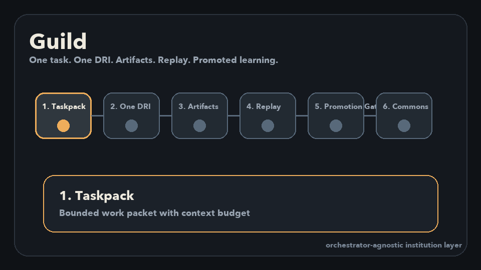

# Guild

[](https://github.com/lucid-fdn/guild/actions/workflows/ci.yml)
[](LICENSE)
[](#install)
[](docs/MCP_SETUP.md)

Every agent run starts with a mandate and ends with proof.



Guild is a TypeScript-first agent work contract for autonomous coding and research agents.
It gives agents a local desk they can consume directly: one mandate, scoped context, preflight guardrails, explicit claims, proof artifacts, handoffs, verification, and replay.

It is not another orchestrator.
It works beside Codex, Claude, OpenClaw, OpenFang, LangGraph, CrewAI, OpenAI Agents SDK, GitHub Actions, and custom stacks.

## The Contract

Agents should not start from a vague chat thread or a giant repo dump.
They should start from a small, inspectable contract:

- `Mandate`: the task, objective, allowed scope, budget, and acceptance criteria
- `Claim`: a local lease so two agents do not take the same work
- `Context Pack`: the smallest role-specific context needed to act
- `Preflight Decision`: allow, deny, or request approval before risky actions
- `Approval`: human consent when policy says the agent should stop and ask
- `Proof Artifact`: tests, diffs, changed files, screenshots, logs, or handoff summaries
- `Replay Bundle`: portable evidence of what happened and why it is done

That is the wedge:

```text
GitHub issue / local task -> mandate -> claim -> bounded context -> work -> proof -> verify -> replay
```

## Start Here

- Use the TypeScript AgentDesk packages in `packages/agentdesk-*`.
- Public install target: `npx guild-agentdesk`.
- Current repo-local alpha command: `node packages/agentdesk-cli/dist/index.js`.
- Run [AgentDesk](#agentdesk-local-agent-workflow) locally with no server.
- Point agents at the executable [MCP server](adapters/mcp/README.md) with copy-paste [host setup](docs/MCP_SETUP.md).
- Turn GitHub issues labeled `agent:ready` into mandates.
- Use `agentdesk verify --github-report` as a PR check.
- Run `make release-check` before shipping.
- Read the [Agent-First Pivot Plan](docs/AGENT_FIRST_PIVOT_PLAN.md) for the product thesis.

## Install

TypeScript-first alpha path from a checkout:

```bash
corepack enable
corepack pnpm install
corepack pnpm run build:agentdesk-ts
node packages/agentdesk-cli/dist/index.js init
node packages/agentdesk-cli/dist/index.js mcp serve
```

Bootstrap GitHub issue intake and CI in an existing repo:

```bash
GITHUB_TOKEN="$(gh auth token)" \
node packages/agentdesk-cli/dist/index.js bootstrap github --repo lucid-fdn/your-repo

GITHUB_TOKEN="$(gh auth token)" \
node packages/agentdesk-cli/dist/index.js issue create "Fix docs typo" \
  --repo lucid-fdn/your-repo \
  --scope "docs/**" \
  --acceptance "Docs are updated and proof is attached."
```

Copy-paste external demo:

```bash
corepack enable
corepack pnpm install
corepack pnpm run build:agentdesk-ts

GITHUB_TOKEN="$(gh auth token)" \
node packages/agentdesk-cli/dist/index.js bootstrap github --repo lucid-fdn/your-repo

GITHUB_TOKEN="$(gh auth token)" \
node packages/agentdesk-cli/dist/index.js issue create "Fix docs typo" \
  --repo lucid-fdn/your-repo \
  --scope "docs/**" \
  --acceptance "Docs are updated and proof is attached."

GITHUB_TOKEN="$(gh auth token)" \
node packages/agentdesk-cli/dist/index.js next --source github --repo lucid-fdn/your-repo

node packages/agentdesk-cli/dist/index.js claim --id <mandate-id> --agent codex
node packages/agentdesk-cli/dist/index.js context compile --id <mandate-id> --role coder
node packages/agentdesk-cli/dist/index.js preflight --id <mandate-id> --action write --path docs/example.md
node packages/agentdesk-cli/dist/index.js proof add --id <mandate-id> --kind test_report --path test-results.xml
node packages/agentdesk-cli/dist/index.js proof add --id <mandate-id> --kind changed_files --path changed-files.json
node packages/agentdesk-cli/dist/index.js handoff create --id <mandate-id> --to reviewer --summary "Ready for review"
node packages/agentdesk-cli/dist/index.js verify --id <mandate-id>
node packages/agentdesk-cli/dist/index.js replay export --id <mandate-id>
```

Legacy/native Go path:

```bash
go install github.com/lucid-fdn/guild/cli/cmd/guild@v0.1.0-alpha.4
guild mcp serve
```

The Go CLI remains available as a native fallback, but the public product direction is TypeScript-first: CLI, MCP, GitHub integration, SDKs, and examples.

## Language Strategy

Guild is now TypeScript-first because agent users expect npm-native CLIs, MCP servers, GitHub tooling, and hackable SDKs.

The historical Go implementation is kept as a native fallback and behavior reference, but it is intentionally excluded from GitHub language stats through `.gitattributes` so the repo advertises the product surface users should start with.

Repo-local MCP server path:

```bash
git clone https://github.com/lucid-fdn/guild.git
cd guild
corepack enable
corepack pnpm install
corepack pnpm run build:agentdesk-ts
node packages/agentdesk-cli/dist/index.js mcp serve
```

Packaging decision for the next public alpha: publish the `guild-agentdesk` npm package once the name/scope is final.

## Why This Exists

The immediate agent pain is not “lack of another control plane.”
It is that agents are asked to work without the operational basics humans rely on:

- What exactly am I allowed to change?
- Who owns this task right now?
- What context do I need, and what context should I ignore?
- When must I stop for approval?
- What proof makes the work complete?
- How can another agent or reviewer replay what happened?

Guild makes those answers machine-readable.

## What Guild Is Not

- not a chatbot framework
- not a swarm runtime
- not a replacement for OpenFang, OpenClaw, LangGraph, CrewAI, or Codex
- not a generic vector memory
- not a human-managed kanban clone
- not a mandatory hosted control plane

Guild is the contract layer agents consume before, during, and after work.
The long-term institution/commons layer is built on top of that contract, not ahead of it.

## AgentDesk Local Agent Workflow

AgentDesk is the zero-server path.
It wraps `agentdesk.yaml` and `.agentdesk/` so agents can self-serve from a repo.

```bash
node packages/agentdesk-cli/dist/index.js init
node packages/agentdesk-cli/dist/index.js bootstrap github --repo lucid-fdn/app
node packages/agentdesk-cli/dist/index.js issue create "Fix failing auth tests" --repo lucid-fdn/app --scope "src/auth/**,tests/auth/**"
node packages/agentdesk-cli/dist/index.js mandate create "Fix failing auth tests" --writable "src/auth/**,tests/auth/**"
node packages/agentdesk-cli/dist/index.js next
node packages/agentdesk-cli/dist/index.js claim --id <mandate-id> --agent codex
node packages/agentdesk-cli/dist/index.js doctor --id <mandate-id>
node packages/agentdesk-cli/dist/index.js context compile --id <mandate-id> --role coder
node packages/agentdesk-cli/dist/index.js preflight --id <mandate-id> --action write --path src/auth/login.ts
node packages/agentdesk-cli/dist/index.js proof add --id <mandate-id> --kind test_report --path test-results.xml
node packages/agentdesk-cli/dist/index.js proof add --id <mandate-id> --kind changed_files --path changed-files.json
node packages/agentdesk-cli/dist/index.js handoff create --id <mandate-id> --to reviewer --summary "Ready for review"
node packages/agentdesk-cli/dist/index.js verify --id <mandate-id>
node packages/agentdesk-cli/dist/index.js replay export --id <mandate-id>
```

Use GitHub Issues as the human task source:

```yaml
task_sources:
  - type: github_issues
    repo: lucid-fdn/app
    query: "label:agent:ready state:open"
```

Then an agent can run:

```bash
GITHUB_TOKEN=... node packages/agentdesk-cli/dist/index.js next --source github
node packages/agentdesk-cli/dist/index.js claim --id <mandate-id> --agent codex
```

Claims are local leases stored in `.agentdesk/claims/`.
By default, `agentdesk next` skips actively claimed mandates so many agents can safely pull from the same desk.

## MCP Server

Guild ships an executable local MCP server for agent hosts.
It exposes AgentDesk as tools backed by the repo's `agentdesk.yaml` and `.agentdesk/` directory.

```bash
node packages/agentdesk-cli/dist/index.js mcp serve
```

For Claude Desktop, Codex, OpenFang, OpenClaw, and generic MCP host configs, see [MCP Setup](docs/MCP_SETUP.md).

Example MCP config:

```json
{
  "mcpServers": {
    "guild-agentdesk": {
      "command": "node",
      "args": ["/absolute/path/to/guild/packages/agentdesk-cli/dist/index.js", "mcp", "serve"],
      "env": {
        "GITHUB_REPOSITORY": "lucid-fdn/guild"
      }
    }
  }
}
```

Main tools:

- `guild_get_next_mandate`
- `guild_claim_mandate`
- `guild_compile_context`
- `guild_check_preflight`
- `guild_request_approval`
- `guild_publish_artifact`
- `guild_create_handoff`
- `guild_verify_mandate`
- `guild_close_mandate`
- `guild_export_replay_bundle`

## What Guild Standardizes

Guild aims to make these portable objects boring, stable, and reusable:

1. `Taskpack`
- the mandate: objective, inputs, constraints, permissions, context budget, and acceptance criteria

2. `DRI Binding`
- one accountable owner plus reviewers, specialists, approvers, and escalation rules

3. `Artifact`
- typed proof output with provenance, lineage, evaluation status, and storage location

4. `Workspace Constitution`
- repo-local rules: scope, defaults, approval rules, task sources, and success criteria

5. `Context Pack`
- role-specific bounded context compiled from the mandate, scope, and artifact references

6. `Preflight Decision`
- allow, deny, or needs-approval result for a proposed agent action

7. `Approval Request`
- human approval state, approver decisions, and policy context

8. `Replay Bundle`
- portable evidence packaging the mandate, proof artifacts, ownership, approvals, and replay data

9. `Promotion Record`, `Promotion Gate`, and `Commons Entry`
- the later learning layer: accepted improvements only enter the commons after evidence and review

## GitHub Actions

Use `agentdesk verify --github-report` to turn the work contract into a CI/PR report:

```bash
node packages/agentdesk-cli/dist/index.js replay export --id <mandate-id> --file .agentdesk/replay/replay.json
node packages/agentdesk-cli/dist/index.js verify --id <mandate-id> --github-report --replay-file .agentdesk/replay/replay.json
```

The report includes:

```text
Agent Work Contract: passed
Mandate: ...
Proof: test_report, changed_files, handoff_summary
Approvals: resolved
Replay: attached
```

## Design Principles

- Agent-first before dashboard-first
- Local-first before hosted-first
- Orchestrator-agnostic from day one
- Artifact-first, not transcript-first
- One task, one owner, one active claim
- Bounded context over shared gossip
- Approvals before risky side effects
- Replayability as a first-class feature
- Learning and commons off the hot path

## Day 1 Demo

The first demo should be legible in under 60 seconds:

1. A GitHub issue labeled `agent:ready` becomes a mandate.
2. An agent asks for the next mandate and claims it.
3. Guild emits a bounded context pack and preflight decisions.
4. The agent works in the allowed scope.
5. The agent publishes test, changed-file, and handoff proof.
6. `agentdesk verify` passes and writes a GitHub Actions report.
7. A replay bundle shows exactly what happened.

## Standards Posture

Guild is designed to compose with:

- [Model Context Protocol (MCP)](https://modelcontextprotocol.io/specification/draft)
- [Agent2Agent (A2A)](https://a2a-protocol.org/dev/specification/)
- [AG-UI](https://github.com/ag-ui-protocol/ag-ui)
- [OpenTelemetry GenAI semantic conventions](https://opentelemetry.io/docs/specs/semconv/gen-ai/)

Guild should avoid inventing new wire protocols when an existing one is good enough.
Its job is to define the work contract agents can consume across runtimes.

## Repository Layout

```text
guild/
  README.md
  .editorconfig
  .gitignore
  Makefile
  package.json
  pnpm-workspace.yaml
  packages/
    agentdesk-core/
    agentdesk-cli/
    agentdesk-github/
    agentdesk-mcp/
  cli/
    cmd/guild/     # legacy/native Go fallback
  pkg/
    spec/          # legacy/native Go fallback
  openapi/
    guild.v1alpha1.yaml
    README.md
  spec/
    README.md
    common.schema.json
    taskpack.schema.json
    dri-binding.schema.json
    artifact.schema.json
    promotion-record.schema.json
    replay-bundle.schema.json
    examples/
  docs/
    IMPLEMENTATION_PLAN.md
    LAUNCH_NARRATIVE.md
    LANDING_PAGE_COPY.md
    adr/
      0001-v1-architecture.md
    quickstart.md
  server/
    README.md
  sdk/
    GENERATION.md
    typescript/
      README.md
      src/
        spec.ts
    python/
      README.md
  ui/
    README.md
  adapters/
    typescript/
      README.md
      src/
        index.ts
    mcp/
      README.md
      src/
        index.ts
    a2a/
      README.md
      src/
        index.ts
    langgraph/
      README.md
      src/
        index.ts
  conformance/
    adapter-profile.schema.json
    profiles/
  workers/
    evaluator/
      README.md
  examples/
    README.md
    one-task-one-dri-commons/
    typescript-adapter-core/
  deploy/
    README.md
    docker-compose.local.yml
    otel-collector.yaml
```

## v1 Scope

Guild v1 target scope:

- agent-consumable `Taskpack`/mandate, context, preflight, approval, proof, replay, and claim workflows
- `Taskpack`, `DRI`, `Artifact`, and `Promotion Record` schemas
- `Replay Bundle` schema for portable replay and evaluation evidence
- a single-node API for teams that want a hosted/shared desk
- Postgres-backed task registry
- object storage-backed artifact system
- approval flow
- replay and trace UI
- MCP and A2A adapters

Guild v1 will not include:

- autonomous commons promotion without human review
- a public marketplace
- federated identity across companies
- settlement, escrow, or billing rails

Current bootstrap implementation:

- local `agentdesk.yaml` and `.agentdesk/` workflow for agents that do not need a server
- local claim leases so multiple agents do not pick the same mandate
- GitHub Issues source adapter for issues labeled `agent:ready`
- GitHub Actions/PR report output for `agentdesk verify`
- executable local MCP server for Codex, Claude, OpenClaw, OpenFang, and other MCP hosts
- JSON Schemas for the four core public objects
- draft 2020-12 spec validation for examples and bootstrap fixtures
- file-backed local API for fast OSS iteration
- `GET/POST` endpoints for `Taskpack`, `DRI Binding`, `Artifact`, and `Promotion Record`
- seeded fixture data for local development and UI testing
- runtime validation for schema version, UUIDs, enums, timestamps, URIs, labels, and token budgets
- runtime validation for replay bundle object validity and internal references
- strict JSON decoding that rejects unknown fields
- file-backed referential integrity for institutions, taskpacks, artifacts, DRI bindings, and promotion records
- Postgres storage behind the current service interfaces with runtime migrations
- local object-storage backend for artifact metadata mirroring
- recursive replay bundle export for task trees through the API and CLI
- replay suite runner that emits benchmark-result artifacts, skill-candidate artifacts, and human-review promotion records
- durable evaluation job queue with queued/running/succeeded/failed states
- in-process evaluator worker for replay suites, with deterministic run endpoint for tests
- governance policies, human approval requests, promotion gates, and commons registry entries
- full simulation script for the one task/DRI/artifact/replay/promoted-learning story
- neutral TypeScript adapter core for orchestrator-specific wrappers
- TypeScript-first `guild-agentdesk mcp serve` server plus MCP bridge package for reusable tool definitions and host compatibility tests
- A2A-style bridge package with task/result mappers
- LangGraph adapter package with a node-shaped bridge for real graph integration
- adapter conformance profiles and a reusable `adapter-alpha` badge
- checked TypeScript adapter-core example that submits a run and exports replay
- Next.js experience plane with live/offline dashboard, task detail, DRI graph, artifact graph, replay timeline, approval inbox shell, and commons panel
- Go tests, UI build checks, spec linting, and a local API smoke test

Planned production hardening:

- managed object storage backend for artifact payloads
- Redis and NATS-backed distributed queues
- dead-letter dashboards and multi-worker leasing

## Local Development

Prerequisites:

- Go 1.23+
- Node.js 22+
- pnpm through Corepack

Install dependencies:

```bash
corepack enable
make install
```

Run all checks:

```bash
make verify
```

Run the full pre-release gate:

```bash
make release-check
```

Run the TypeScript-first AgentDesk simulation directly:

```bash
make agentdesk-ts
```

Validate the HTTP API contract:

```bash
make lint-openapi
```

Validate local Markdown links:

```bash
make lint-docs
```

Validate fixture and example references:

```bash
make lint-fixtures
```

SDK generation is vendor-neutral. OpenAPI is the source of truth for the HTTP API; Speakeasy is only an optional scaffold. See `sdk/GENERATION.md`.

Validate one object through the CLI:

```bash
go run ./cli/cmd/guild validate --kind taskpack --file spec/examples/taskpack.example.json
go run ./cli/cmd/guild validate --kind replay-bundle --file spec/examples/replay-bundle.example.json
go run ./cli/cmd/guild validate --kind workspace-constitution --file spec/examples/workspace-constitution.example.json
```

Run the agent-first local workflow without a server:

```bash
node packages/agentdesk-cli/dist/index.js init
node packages/agentdesk-cli/dist/index.js mandate create "Fix failing auth tests" --writable "src/auth/**,tests/auth/**"
node packages/agentdesk-cli/dist/index.js next
node packages/agentdesk-cli/dist/index.js claim --id <mandate-id> --agent codex
node packages/agentdesk-cli/dist/index.js next --source github --repo lucid-fdn/app --query "label:agent:ready state:open"
node packages/agentdesk-cli/dist/index.js context compile --id <mandate-id> --role coder
node packages/agentdesk-cli/dist/index.js preflight --id <mandate-id> --action write --path src/auth/login.ts
node packages/agentdesk-cli/dist/index.js approval request --id <mandate-id> --reason "Need owner consent"
node packages/agentdesk-cli/dist/index.js approval resolve --approval-id <approval-id> --decision approved
node packages/agentdesk-cli/dist/index.js proof add --id <mandate-id> --kind test_report --path test-results.xml
node packages/agentdesk-cli/dist/index.js handoff create --id <mandate-id> --to reviewer --summary "Ready for review"
node packages/agentdesk-cli/dist/index.js verify --id <mandate-id>
node packages/agentdesk-cli/dist/index.js close --id <mandate-id>
node packages/agentdesk-cli/dist/index.js replay export --id <mandate-id>
```

Use GitHub Issues as the human task source:

```yaml
task_sources:
  - type: github_issues
    repo: lucid-fdn/app
    query: "label:agent:ready state:open"
```

Then agents can run:

```bash
GITHUB_TOKEN=... node packages/agentdesk-cli/dist/index.js next --source github
```

In GitHub Actions, use `agentdesk verify --github-report` to write the PR/step report:

```bash
node packages/agentdesk-cli/dist/index.js replay export --id <mandate-id> --file .agentdesk/replay/replay.json
node packages/agentdesk-cli/dist/index.js verify --id <mandate-id> --github-report --replay-file .agentdesk/replay/replay.json
```

The report includes:

```text
Agent Work Contract: passed
Mandate: ...
Proof: test_report, changed_files, handoff_summary
Approvals: resolved
Replay: attached
```

Run the server:

```bash
make run-server
```

Run the UI in another shell:

```bash
make run-ui
```

Run all adapter checks:

```bash
make check-adapters
```

Adapter packages:

- `@guild/adapter-core` provides neutral builders for `Taskpack`, `DRI Binding`, and `Artifact`.
- `@lucid-fdn/agentdesk-mcp` exposes the TypeScript-first local MCP server; `@guild/adapter-mcp` remains for adapter development.
- `@guild/adapter-a2a` maps A2A-style task/result envelopes into Guild institutional records.
- `@guild/adapter-langgraph` provides a LangGraph-compatible node that submits Taskpack, DRI, and Artifact records while returning a graph state patch.

Useful endpoints:

```text
GET  http://localhost:8080/healthz
GET  http://localhost:8080/api/v1/status
GET  http://localhost:8080/api/v1/taskpacks
GET  http://localhost:8080/api/v1/replay/taskpacks/{taskpack_id}
POST http://localhost:8080/api/v1/taskpacks
POST http://localhost:8080/api/v1/dri-bindings
POST http://localhost:8080/api/v1/artifacts
POST http://localhost:8080/api/v1/promotion-records
POST http://localhost:8080/api/v1/governance-policies
POST http://localhost:8080/api/v1/approval-requests
POST http://localhost:8080/api/v1/promotion-gates
POST http://localhost:8080/api/v1/commons-entries
```

Run conformance checks against a running Guild-compatible API:

```bash
go run ./cli/cmd/guild conformance --base-url http://localhost:8080
```

Run the full local e2e adopter journey:

```bash
make e2e
```

Export a portable replay bundle:

```bash
go run ./cli/cmd/guild replay-export \
  --base-url http://localhost:8080 \
  --taskpack-id 4e1fe00c-6303-453c-8cb6-2c34f84896e4
```

Run a replay/evaluation suite and open a promotion candidate:

```bash
go run ./cli/cmd/guild replay-suite \
  --base-url http://localhost:8080 \
  --suite examples/replay-suite.example.json
```

Queue a replay/evaluation job through the shared API worker path:

```bash
go run ./cli/cmd/guild eval-submit \
  --base-url http://localhost:8080 \
  --suite examples/replay-suite.example.json \
  --wait
```

Run the full launch simulation:

```bash
make simulation
```

Run the canonical launch example:

```bash
examples/one-task-one-dri-commons/run.sh
```

Launch assets live in [launch](launch/README.md).

Optional local infrastructure:

- Postgres
- Redis
- NATS JetStream
- MinIO
- OpenTelemetry Collector

Use `make dev-up` to bring up the optional infrastructure and `make dev-down` to stop it. The default server is file-backed and does not require this stack; set `GUILD_STORAGE_DRIVER=postgres` and `GUILD_DATABASE_URL` to use Postgres.

## Verification

`make verify` runs:

- frozen pnpm install
- JSON Schema validation for public examples and bootstrap fixtures
- OpenAPI validation for the bootstrap control-plane API
- Markdown local link validation
- fixture and public example reference validation
- adapter conformance profile validation
- generated TypeScript SDK spec type drift check
- CLI validation for public examples
- Go unit tests
- Go server build
- Go CLI build
- TypeScript SDK check
- Python SDK compile check
- TypeScript adapter checks
- TypeScript example check
- TypeScript check
- Next.js production build
- local API smoke test

`make e2e` additionally starts a fresh server and exercises CLI conformance,
CLI replay export, replay-suite promotion candidate creation, durable evaluation
job submission, Python SDK reads, the TypeScript adapter example, and replay
bundle validation.

`make release-check` runs `make verify`, `make e2e`, and release guardrails for
ignored source paths, executable scripts, and generated local artifacts.

## Initial Build Sequence

1. Freeze the agent work-contract objects.
2. Build the local AgentDesk workflow.
3. Add MCP and GitHub source integrations.
4. Build the shared API and trace/replay UI.
5. Add A2A and orchestrator adapters.
6. Add learning-plane candidate extraction and benchmark-driven promotion gates.

## Category

Guild is an agent work-contract layer.

Short version:

Mandate. Claim. Context. Proof. Replay.
